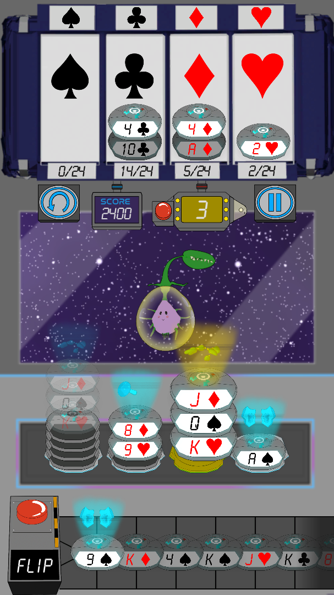

<!-- PROJECT LOGO -->

  
  
  

    
    
  

  

    A game development project started by a Hampshire College course in 2019!
     
    Launching on the app stores soon hopefully.
     
     
    ·
    <a href="https://jonalaw.itch.io/cosmia?secret=LP0fyQ5uWSodYKsY9mfEAjt60k"> Play in Web Browser</a>
    ·
    <a href="https://github.com/HampshireCollegeCompSci/cs327_f2019/releases">View Latest Releases</a>
    ·
  

<!-- ABOUT THE PROJECT -->
## About The Project
Cosmia, Cosmic Solitaire is the result of the course of CS327 at Hampshire College during the Fall of 2019. Teams from different disciplines were formed to create a new solitare like game that could be published on the mobile app stores. At the end of the semester, the project was over halfway completed.

During the 2020 Spring semester, a small group of developers consiting of members from various teams stayed to finish Cosmia. These members are indicated by a ⭐ in the credits section. They managed to get the game near completion.

Afterwards in 2021, the programmer Jona began work to finalize the game. In early 2022, Cosmia was stable and feature rich enough to start the distribution of builds for final playtesting.

  
<b>Credits</b> (click to expand)

  
#### Executive Producers
- Bassam Kurdali - Executive Producer of Art
- Ira Fay - Executive Producer of Game Design

#### Production
- Armon Walker ⭐ - Lead Producer
- Luke Townsend - Game Design Producer
- Alexandra Webb - Audio Design Producer
- Lucas Kohn - Art Producer
- Corbin Nelson - Programming Producer

#### Game Design
- Alex McGrath - Lead Game Designer
- Doug Levey - Game Designer
- Sam Dormer - Game Designer
- Sam Fioretti - Game Designer
- Matt Regan - Game Designer

#### Art
- Nat Mongilio ⭐ - Lead Artist
- Chhavi Kumar - 2D Animator and TA
- Anna Christensen-Goodfellow ⭐ - 3D Artist
- Dharam Bir Khalsa - 3D Artist
- Fang Chen - 3D Artist
- Connor Ryan - 2D Artist
- Peter Watko - 2D Artist
- Wolfie Smith - 2D Artist and UI Design

#### Audio
- Richie Olivas-Knapton - Lead Audio Designer
- Granger Smith-Massa - Audio Designer
- Zofia Shura - Audio Designer

#### Programing
- Shan Jiang - Lead Programmer
- Ian Macpherson - Programmer
- Jona Lawrence ⭐ - Programmer
- Max Mark - Programmer
- Noah Brinton - Programmer
- Per Van Dyke ⭐ - Programmer

 

<!-- USAGE EXAMPLES -->
## Gameplay

  
<b>Images</b> (click to expand)

  

 

<!-- ROADMAP -->
## Roadmap

- [x] Add Interactability to the Tutorial
- [x] Add More Settings Options
- [x] Address Aspect Ratio Issues
- [ ] Launch On App Stores
- [ ] Multi-language Support?

See the [open issues](https://github.com/HampshireCollegeCompSci/cs327_f2019/issues) for a full list of proposed features (and known issues).
  

## Built With
* [Unity](https://unity.com/)
  

<!-- LICENSE -->
## License
Distributed under the Creative Commons License. See [`LICENSE.txt`](LICENSE) for more information.
  

<!-- ACKNOWLEDGMENTS -->
## Acknowledgments
* [Benoit Freslon's Vibration Unity Package](https://github.com/BenoitFreslon/Vibration)
* [Othneil Drew's Best-README-Template](https://github.com/othneildrew/Best-README-Template)
